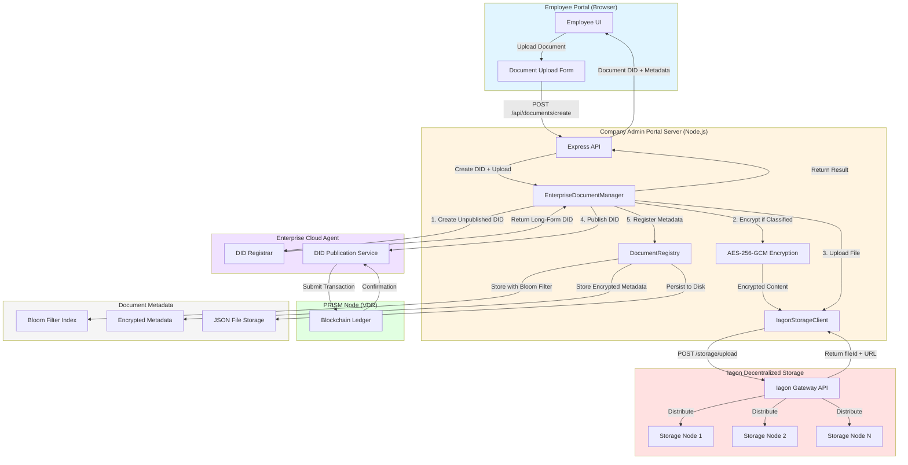
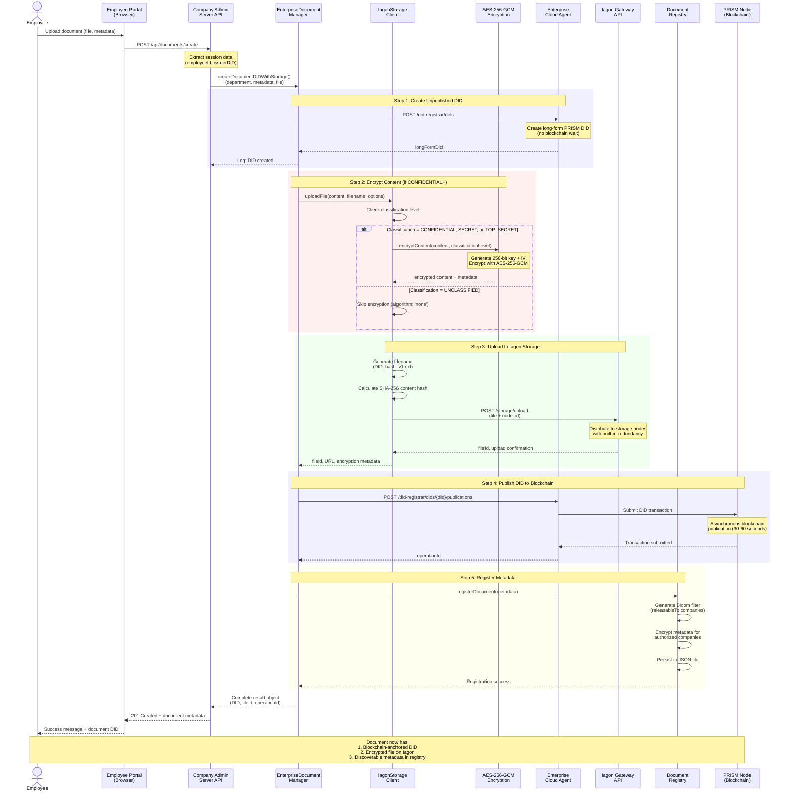
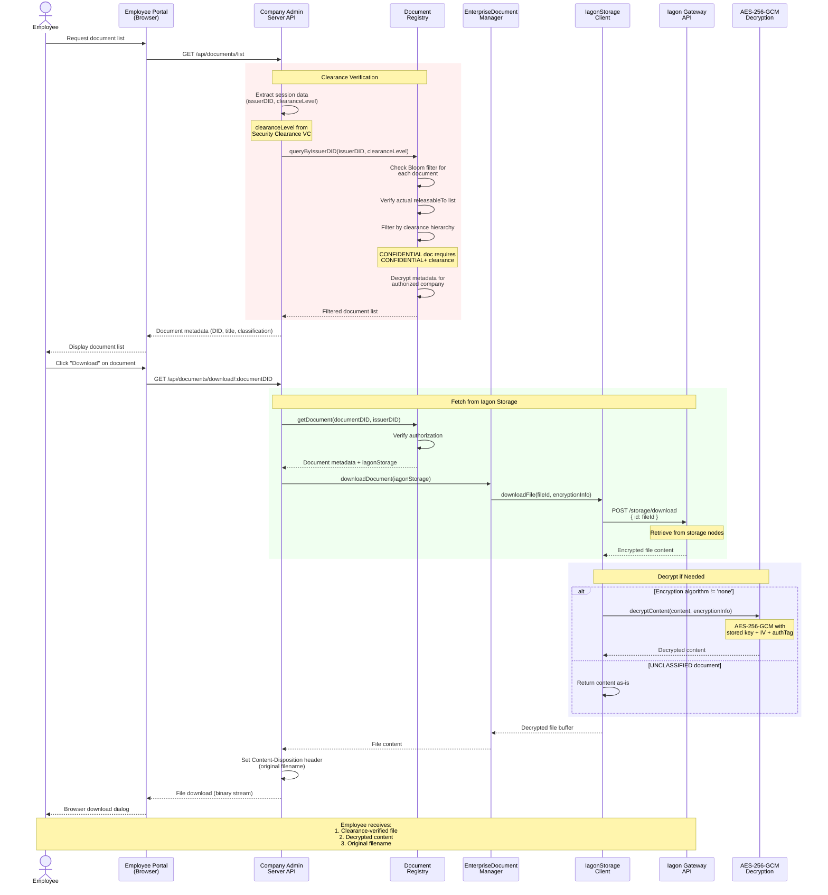
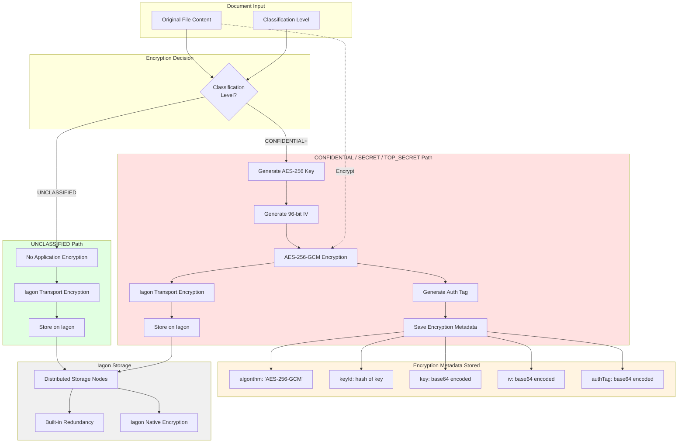

# Iagon Decentralized Storage Architecture

**Document Version**: 1.0
**Last Updated**: 2025-12-07
**Status**: Production-Ready

## Overview

This document describes the architecture for integrating Iagon decentralized storage with the Hyperledger Identus SSI infrastructure for document management with blockchain-anchored DIDs.

---

## 1. System Architecture

The following diagram shows the high-level system architecture with all major components and their interactions.



### Component Responsibilities

| Component | Responsibility |
|-----------|---------------|
| **Employee Portal (Browser)** | User interface for document upload and management |
| **Company Admin Portal Server** | Business logic, encryption, orchestration |
| **EnterpriseDocumentManager** | Orchestrates DID creation + file storage workflow |
| **IagonStorageClient** | Handles Iagon API communication and encryption |
| **DocumentRegistry** | Privacy-preserving metadata storage with Bloom filters |
| **Enterprise Cloud Agent** | PRISM DID creation and blockchain publication |
| **PRISM Node** | Blockchain ledger for DID anchoring |
| **Iagon Storage** | Decentralized file storage with redundancy |

---

## 2. Document Upload Flow

This sequence diagram shows the detailed step-by-step process when an employee uploads a document.



### Upload Flow Steps

1. **Create Unpublished DID** (1-2 seconds)
   - Long-form PRISM DID created instantly
   - No blockchain wait required for usability

2. **Encrypt Content** (100-500ms for typical files)
   - UNCLASSIFIED: No encryption (Iagon provides transport encryption)
   - CONFIDENTIAL+: AES-256-GCM with random key
   - Encryption metadata stored for later decryption

3. **Upload to Iagon** (2-10 seconds depending on file size)
   - File distributed across decentralized nodes
   - Returns fileId for download API
   - Maximum file size: 40MB

4. **Publish DID to Blockchain** (30-60 seconds asynchronous)
   - DID immediately usable (long-form)
   - Blockchain publication confirms in background
   - OperationId for status polling

5. **Register Metadata** (50-100ms)
   - Bloom filter for privacy-preserving discovery
   - Metadata encrypted per authorized company
   - Persisted to JSON file for crash recovery

### Performance Characteristics

| Operation | Time | Notes |
|-----------|------|-------|
| DID Creation | 1-2s | Synchronous API call |
| Encryption | 100-500ms | Depends on file size |
| Iagon Upload | 2-10s | Network-dependent |
| DID Publication | 30-60s | Asynchronous (background) |
| Metadata Registration | 50-100ms | In-memory + disk write |
| **Total User Wait** | **5-15s** | DID usable immediately |

---

## 3. Document Download Flow

This sequence diagram shows how employees retrieve documents with clearance verification.



### Download Flow Steps

1. **List Documents** (100-200ms)
   - Extract employee's issuerDID and clearanceLevel from session
   - Query DocumentRegistry with Bloom filter optimization
   - Filter by clearance hierarchy
   - Return only authorized + accessible documents

2. **Clearance Verification**
   - Check if employee's clearanceLevel meets document requirement
   - Clearance hierarchy: UNCLASSIFIED (1) < CONFIDENTIAL (2) < SECRET (3) < TOP_SECRET (4)
   - Employee with CONFIDENTIAL can access UNCLASSIFIED + CONFIDENTIAL
   - Employee with no clearance can only access UNCLASSIFIED

3. **Fetch from Iagon** (2-5 seconds)
   - Use fileId from metadata (required for download API)
   - POST request to /storage/download endpoint
   - Iagon retrieves from distributed nodes

4. **Decrypt Content** (100-300ms)
   - UNCLASSIFIED: No decryption needed
   - CONFIDENTIAL+: AES-256-GCM decryption with stored key
   - Verify auth tag for integrity

5. **Return File**
   - Set Content-Disposition header with original filename
   - Stream binary content to browser
   - Browser handles file download

### Clearance-Based Filtering Logic

```javascript
// Employee with CONFIDENTIAL clearance
clearanceLevel = "CONFIDENTIAL" // Level 2

// Document classifications and accessibility
UNCLASSIFIED document   // Level 1 - ACCESSIBLE (2 >= 1)
CONFIDENTIAL document   // Level 2 - ACCESSIBLE (2 >= 2)
SECRET document         // Level 3 - FILTERED (2 < 3)
TOP_SECRET document     // Level 4 - FILTERED (2 < 4)
```

---

## 4. Encryption Strategy

This diagram shows the multi-layered encryption approach based on classification levels.



### Classification Levels and Encryption

| Level | Code | Application Encryption | Iagon Encryption | Total Layers |
|-------|------|----------------------|------------------|--------------|
| **UNCLASSIFIED** | 1 | None | Transport + Storage | 1-2 layers |
| **CONFIDENTIAL** | 2 | AES-256-GCM | Transport + Storage | 2-3 layers |
| **SECRET** | 3 | AES-256-GCM | Transport + Storage | 2-3 layers |
| **TOP_SECRET** | 4 | AES-256-GCM | Transport + Storage | 2-3 layers |

### Encryption Details

**Application-Level Encryption (CONFIDENTIAL+)**:
- Algorithm: AES-256-GCM (Galois/Counter Mode)
- Key size: 256 bits (32 bytes) - randomly generated
- IV size: 96 bits (12 bytes) - recommended for GCM
- Authentication: Built-in auth tag (128 bits)
- Implementation: Node.js crypto module

**Iagon Storage Encryption**:
- Transport encryption: HTTPS/TLS for upload/download
- Storage encryption: Iagon's native encryption at rest
- Redundancy: Distributed across multiple nodes
- Access control: API key authentication

### Security Properties

1. **Confidentiality**: AES-256-GCM provides strong confidentiality
2. **Integrity**: Auth tag ensures content hasn't been tampered
3. **Authentication**: Only authorized companies can decrypt metadata
4. **Defense in Depth**: Multiple encryption layers (app + Iagon)
5. **Key Management**: Keys stored in DocumentRegistry (encrypted per company)

---

## 5. Data Flow Summary

### Document Creation Flow

```
Employee Upload
    ↓
Server receives file + metadata
    ↓
Create PRISM DID (1-2s)
    ↓
Encrypt if CONFIDENTIAL+ (100-500ms)
    ↓
Upload to Iagon (2-10s)
    ↓
Publish DID to blockchain (async 30-60s)
    ↓
Register metadata in DocumentRegistry (50-100ms)
    ↓
Return success to employee (total 5-15s)
```

### Document Retrieval Flow

```
Employee requests document list
    ↓
Server queries DocumentRegistry
    ↓
Filter by clearance level
    ↓
Return accessible documents (100-200ms)
    ↓
Employee clicks download
    ↓
Verify authorization + clearance
    ↓
Fetch from Iagon using fileId (2-5s)
    ↓
Decrypt if encrypted (100-300ms)
    ↓
Stream to browser (total 3-6s)
```

---

## 6. Key Design Decisions

### Why Iagon for Document Storage?

1. **Decentralization**: No single point of failure
2. **Redundancy**: Built-in multi-node replication
3. **Encryption**: Native encryption at rest
4. **Cost-effective**: More affordable than centralized cloud
5. **Privacy**: No vendor lock-in, censorship-resistant

### Why PRISM DIDs for Documents?

1. **Immutability**: Blockchain-anchored permanent record
2. **Verifiability**: Anyone can verify DID authenticity
3. **Interoperability**: W3C DID standard compliance
4. **Ownership**: Company controls document DIDs
5. **Audit trail**: Blockchain provides tamper-proof history

### Why Bloom Filters for Discovery?

1. **Privacy**: No exposure of full releasableTo lists
2. **Performance**: O(k) lookup (k = hash functions)
3. **Space efficiency**: 1024 bits per document
4. **False positives**: ~0.1% rate (acceptable)
5. **No false negatives**: Guaranteed correct filtering

### Why AES-256-GCM for Encryption?

1. **NIST approved**: Federal standard for classified data
2. **Authenticated encryption**: Integrity + confidentiality
3. **Performance**: Hardware acceleration available
4. **Security**: No known practical attacks
5. **Simplicity**: Single algorithm for encrypt + authenticate

---

## 7. Implementation Components

### IagonStorageClient

**File**: `/root/company-admin-portal/lib/IagonStorageClient.js`

**Responsibilities**:
- Iagon API communication (upload, download, delete)
- AES-256-GCM encryption/decryption
- Content hash calculation (SHA-256)
- Retry logic with exponential backoff
- Filename generation (DID-based)

**Key Methods**:
- `uploadFile(content, filename, options)` - Upload with optional encryption
- `downloadFile(fileId, encryptionInfo)` - Download with decryption
- `encryptContent(content, classificationLevel)` - AES-256-GCM encryption
- `decryptContent(encryptedContent, encryptionInfo)` - AES-256-GCM decryption
- `testConnection()` - Validate Iagon configuration

### EnterpriseDocumentManager

**File**: `/root/company-admin-portal/lib/EnterpriseDocumentManager.js`

**Responsibilities**:
- Orchestrate DID creation + file storage
- Interface with Enterprise Cloud Agent
- Manage DID publication lifecycle
- Coordinate with IagonStorageClient and DocumentRegistry

**Key Methods**:
- `createDocumentDIDWithStorage(dept, metadata, file, filename)` - Complete workflow
- `createDocumentDID(dept, metadata)` - DID-only creation
- `waitForPublication(operationId)` - Poll blockchain publication status
- `downloadDocument(iagonStorage)` - Retrieve file from Iagon
- `checkIagonStatus()` - Validate Iagon connectivity

### DocumentRegistry

**File**: `/root/company-admin-portal/lib/DocumentRegistry.js`

**Responsibilities**:
- Privacy-preserving document metadata storage
- Bloom filter generation and querying
- Clearance-based access control
- Metadata encryption per company
- Crash recovery persistence

**Key Methods**:
- `registerDocument(metadata)` - Add document with Bloom filter
- `queryByIssuerDID(issuerDID, clearanceLevel)` - Find accessible documents
- `meetsClassificationRequirement(clearance, classification)` - Clearance check
- `generateBloomFilter(companyDIDs)` - Create 1024-bit filter
- `getDocument(documentDID, companyDID)` - Retrieve with authorization

---

## 8. Configuration

### Environment Variables

```bash
# Iagon Configuration
IAGON_ACCESS_TOKEN=your_api_token_here
IAGON_NODE_ID=your_node_id_here
IAGON_DOWNLOAD_BASE_URL=https://gw.iagon.com/api/v2

# Enterprise Cloud Agent
ENTERPRISE_CLOUD_AGENT_URL=http://91.99.4.54:8200
ENTERPRISE_CLOUD_AGENT_API_KEY=default.techn...

# Database (for future PostgreSQL migration)
DB_HOST=localhost
DB_PORT=5432
DB_NAME=document_registry
DB_USER=postgres
DB_PASSWORD=your_secure_password
```

### Iagon Setup

1. Sign up at https://iagon.com/
2. Create storage node or use shared infrastructure
3. Get API access token from dashboard
4. Get node ID for file storage
5. Set environment variables in `.env`

### Testing Configuration

```bash
# Test Iagon connectivity
curl https://gw.iagon.com/api/v2/

# Test with API key
curl -H "x-api-key: YOUR_TOKEN" https://gw.iagon.com/api/v2/storage/upload

# Validate environment variables
node -e "console.log(require('./lib/IagonStorageClient').getIagonClient().isConfigured())"
```

---

## 9. Performance Metrics

### Upload Performance

| File Size | Encryption Time | Upload Time | Total Time |
|-----------|----------------|-------------|------------|
| 1KB | <10ms | 1-2s | 2-3s |
| 100KB | 10-50ms | 2-3s | 3-4s |
| 1MB | 50-100ms | 3-5s | 4-6s |
| 10MB | 100-300ms | 5-8s | 6-9s |
| 40MB (max) | 300-500ms | 8-12s | 9-13s |

### Download Performance

| File Size | Download Time | Decryption Time | Total Time |
|-----------|--------------|----------------|------------|
| 1KB | 1-2s | <10ms | 2s |
| 100KB | 2s | 10-20ms | 2-3s |
| 1MB | 2-3s | 20-50ms | 3-4s |
| 10MB | 3-5s | 50-100ms | 4-5s |
| 40MB (max) | 5-8s | 100-200ms | 6-8s |

### Query Performance

| Operation | Time | Notes |
|-----------|------|-------|
| Bloom filter check | <1ms | Per document |
| Metadata decryption | 1-2ms | Per document |
| Query 100 documents | 50-100ms | With clearance filter |
| Query 1000 documents | 200-500ms | With clearance filter |

---

## 10. Future Enhancements

### Phase 1 (Current)
- [x] Iagon file storage integration
- [x] AES-256-GCM encryption
- [x] PRISM DID anchoring
- [x] Bloom filter privacy
- [x] Clearance-based access control

### Phase 2 (Planned)
- [ ] Attribute-Based Encryption (ABE) for content keys
- [ ] Company public key encryption for metadata
- [ ] PostgreSQL backend for DocumentRegistry
- [ ] Full-text search with privacy preservation
- [ ] DocumentMetadata VCs for SSI-native discovery

### Phase 3 (Future)
- [ ] IPFS integration as alternative storage
- [ ] Zero-knowledge proofs for clearance verification
- [ ] Decentralized access control with smart contracts
- [ ] Multi-party computation for sensitive operations
- [ ] Integration with enterprise key management systems

---

## 11. Security Considerations

### Current Security Measures

1. **Encryption at Rest**: AES-256-GCM for CONFIDENTIAL+ documents
2. **Transport Security**: HTTPS/TLS for all API calls
3. **Access Control**: Clearance hierarchy enforcement
4. **Authentication**: API key for Iagon access
5. **Integrity**: Auth tags verify content hasn't been tampered
6. **Privacy**: Bloom filters hide full authorization lists

### Known Limitations

1. **Key Management**: Encryption keys stored in DocumentRegistry
   - **Mitigation**: Plan to encrypt with company public keys (Phase 2)

2. **Metadata Encryption**: Simple AES-256-GCM (not ABE)
   - **Mitigation**: ABE implementation planned (Phase 2)

3. **Single Point of Failure**: DocumentRegistry in-memory storage
   - **Mitigation**: PostgreSQL migration planned (Phase 2)

4. **No Key Rotation**: Keys are static after document creation
   - **Mitigation**: Key rotation mechanism planned (Phase 3)

### Threat Model

| Threat | Mitigation | Status |
|--------|-----------|--------|
| Unauthorized access to files | Clearance verification + encryption | Implemented |
| Network eavesdropping | HTTPS/TLS | Implemented |
| File tampering | Auth tag verification | Implemented |
| Metadata leakage | Bloom filters + encrypted metadata | Implemented |
| Compromised storage nodes | AES-256-GCM encryption | Implemented |
| Key compromise | Company public key encryption | Planned (Phase 2) |
| Registry server compromise | ABE for content keys | Planned (Phase 2) |

---

## 12. Monitoring and Debugging

### Logging

All components log to console with prefixes:

```
[IagonStorageClient] Upload attempt 1/3 for document.pdf
[EnterpriseDocManager] Step 1: Creating unpublished DID...
[DocumentRegistry] Document registered: did:prism:abc123...
```

### Health Checks

```bash
# Check Iagon connectivity
curl http://localhost:3010/api/iagon/status

# Check DocumentRegistry stats
curl http://localhost:3010/api/documents/stats

# Response:
{
  "totalDocuments": 42,
  "byClassification": {
    "UNCLASSIFIED": 20,
    "CONFIDENTIAL": 15,
    "SECRET": 5,
    "TOP_SECRET": 2
  }
}
```

### Common Issues

1. **Upload fails with 401**: Check IAGON_ACCESS_TOKEN
2. **Upload fails with 404**: Verify IAGON_NODE_ID exists
3. **Download fails**: Ensure fileId is stored (not just filename)
4. **Decryption fails**: Verify encryptionInfo metadata is complete
5. **Clearance filter too restrictive**: Check Security Clearance VC issuance

---

## Conclusion

This architecture provides a robust, privacy-preserving document management system with:

- Blockchain-anchored DIDs for permanent records
- Decentralized storage for resilience
- Clearance-based access control for security
- Bloom filter privacy for metadata discovery
- Multi-layered encryption for confidential data

The modular design allows for incremental enhancements (ABE, PostgreSQL, IPFS) while maintaining backward compatibility with existing documents.

---

**References**:
- [Iagon API Documentation](https://api.docs.iagon.com/)
- [PRISM DID Method](https://github.com/input-output-hk/prism-did-method-spec)
- [W3C DID Core](https://www.w3.org/TR/did-core/)
- [AES-GCM Specification](https://nvlpubs.nist.gov/nistpubs/Legacy/SP/nistspecialpublication800-38d.pdf)
- [Bloom Filter Introduction](https://en.wikipedia.org/wiki/Bloom_filter)
